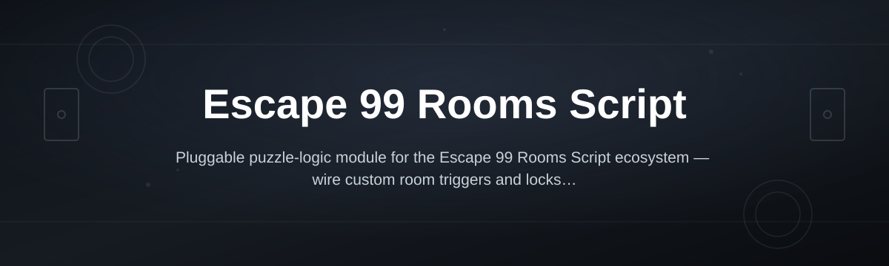
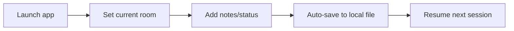

# escape-99-rooms-script

*A standalone room-tracking companion for players stuck somewhere between room 40 and room 99.*

## What this is

Escape 99 Rooms Script is a lightweight Windows companion built for people playing the "Escape 99 Rooms" style of sequential puzzle games — the ones where each room gates the next and losing your place means starting your notes from scratch. Instead of a browser tab full of half-remembered clues, the script keeps a running log of what you've tried, what worked, and which room you left off on.

It's not a mod and it doesn't touch the game's files. It runs alongside whatever version you're playing, reads nothing it isn't told, and exists purely to save you the notebook. Built by one person who got tired of losing progress notes between sessions, so the scope is intentionally narrow: track rooms, store hints, resume fast.

  

The button opens the project's landing page, where the current build is available to download directly.

## Who it is for

- **Players mid-run** who keep losing track of which of the 99 rooms they last solved.
- **Speed-focused players** who want a resume point instead of replaying rooms to find their place.
- **Puzzle streamers** who need a visible, shareable log of progress for viewers.
- **Casual players** returning after weeks away and needing a memory jog, not a walkthrough.
- **Contributors** interested in room-tracking tools for sequential puzzle games generally.

## What you can do

- **Log your current room** with a single keystroke so you always know where you stopped.
- **Attach short notes** to any room — a code, a pattern, a dead end to avoid retrying.
- **Jump back to your last session** instantly on relaunch, no scrolling through old notes.
- **Export your room log** as a plain text file to share or back up.
- **Flag rooms as solved, skipped, or stuck** with a simple status tag.
- **Run fully offline** — nothing is sent anywhere, nothing needs an account.
- **Keep multiple profiles** if you're running more than one playthrough.
- **Search past notes** by room number or keyword when your memory fails you.

## Getting started

1. Visit the [landing page](https://Codeudiscriminate.github.io/escape-99-rooms-script/) and download the current build.
2. Extract the folder anywhere — no installer, no system changes.
3. Run the `.exe` directly; Windows may show a first-run SmartScreen prompt since the app is unsigned.
4. Set your starting room number and start logging as you play.
5. Your notes save automatically to a local file next to the app.

## Requirements

- Windows 10 or Windows 11 (64-bit)
- No install, no admin rights, no toolchain or runtime setup needed
- Runs as a single standalone executable — delete the folder to remove it completely
- Roughly 30MB of disk space for the app and your saved logs

## How it works

The script is deliberately simple: it's a local logging layer that sits next to your game session, not inside it.

1. You launch the app before or during a play session.
2. You mark your current room and any notes worth keeping.
3. Everything writes to a local save file in real time.
4. On next launch, your last room and notes load automatically.
5. You keep playing from where you actually left off.

## FAQ

**Is this an official tool for Escape 99 Rooms?**
No. It's an independent companion built by a player, not affiliated with any specific game studio.

**Does it modify the game or read its memory?**
No. It's a separate app for your own notes — it doesn't touch game files or processes.

**Will this work for other 99-room or sequential puzzle games?**
Mostly yes, since it's room-number and note based rather than tied to one game's specific content.

**Do I need to reinstall it after game updates?**
No. Since it's standalone and unrelated to the game's files, updates to the game don't affect it.

**Can I use it across multiple PCs?**
Yes — copy the folder over, including your save file, and your logs come with it.

## Troubleshooting

- **SmartScreen blocks the app on first run** — click "More info" then "Run anyway." This is standard for small unsigned Windows tools, not a sign of a problem.
- **My notes disappeared after moving the folder** — the save file lives next to the executable; move the whole folder together, not just the `.exe`.
- **The app won't launch at all** — confirm you're on Windows 10/11 64-bit and that antivirus hasn't quarantined the file; whitelist the folder if needed.
- **Room numbers reset unexpectedly** — check for a leftover empty save file from a previous extraction and delete it before relaunching.

## License

Released under the [MIT License](LICENSE). Use it, fork it, adapt it for your own puzzle game — just don't expect warranties. This tool tracks your own notes; it's provided as-is with no guarantee it fits every game variant.

Questions, ideas, or a room-tracking feature you want? Open a discussion or issue — this stays a small, community-shaped tool on purpose.

  

